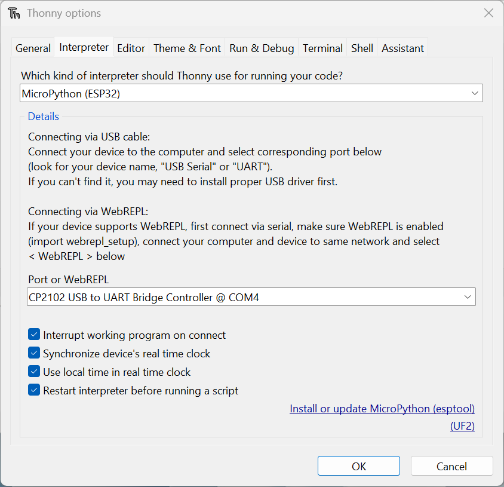
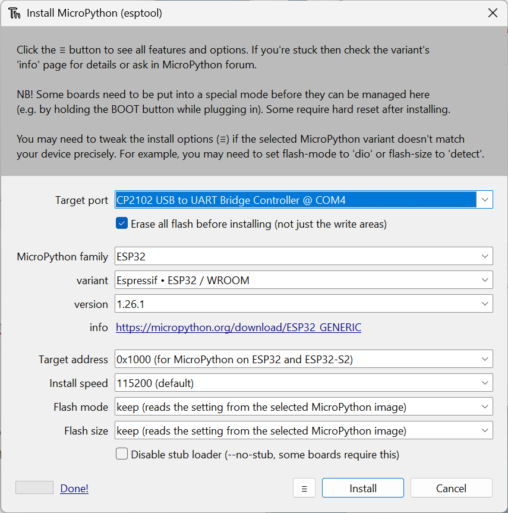
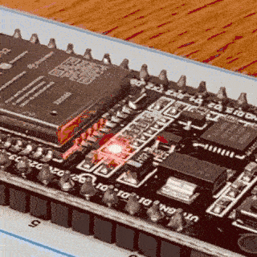

# Setting up ESP32 in Windows

Ref. [Getting Started with Thonny MicroPython (Python) IDE for ESP32 and ESP8266 | Random Nerd Tutorials](https://randomnerdtutorials.com/getting-started-thonny-micropython-python-ide-esp32-esp8266/#install-thonny-ide-windows)

Also [1. Getting started with MicroPython on the ESP32 — MicroPython latest documentation](https://docs.micropython.org/en/latest/esp32/tutorial/intro.html)

## Install Thonny IDE

1. Download Thonny installer for Windows from [https://thonny.org](https://thonny.org/) then double-click on the .exe file to follow the installation wizard

## Flash Micropython on the board

1. Connect the board to the computer

2. Open Thonny IDE. Go to **Tools** > **Options** > **Interpreter**

3. Select the interpreter **Micropython(ESP32)**

4. Select the port **CP2102 USB to UART Bridge Controller @ COM4**

   In my case Windows didn't detect a new COM port when connecting the device and in the **Device Manager** there was a warning in the **CP2102 USB to UART Bridge controller**, so I reinstalled the driver:

   * Right-click > Uninstall device

   * Download the updated **CP210x Universal Windows Driver** from [CP210x USB to UART Bridge VCP Drivers - Silicon Labs]((https://www.silabs.com/software-and-tools/usb-to-uart-bridge-vcp-drivers?tab=downloads))

   * Right-click the zip --> **Extract all**

   * Right-click on `silabser.inf` --> **Install**

   * Close and reopen Thonny and it should work

2. Click on **Install or update Micropython (esptool)**



3. Select again port, family and variant of the board, click **Install**



4. test it in the REPL (this should make the led flash 3 times at 1s intervals)

```python
>>> from utime import sleep
>>> from machine import Pin
>>> led = Pin(2, Pin.OUT)
>>> for i in range(6):
    	led.value(not led.value())
    	sleep(.5)
>>>
```

