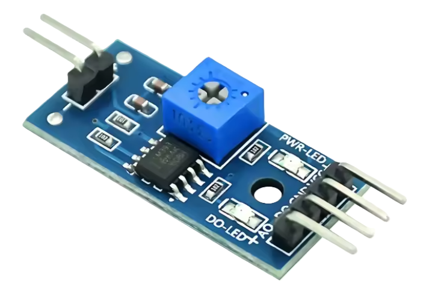
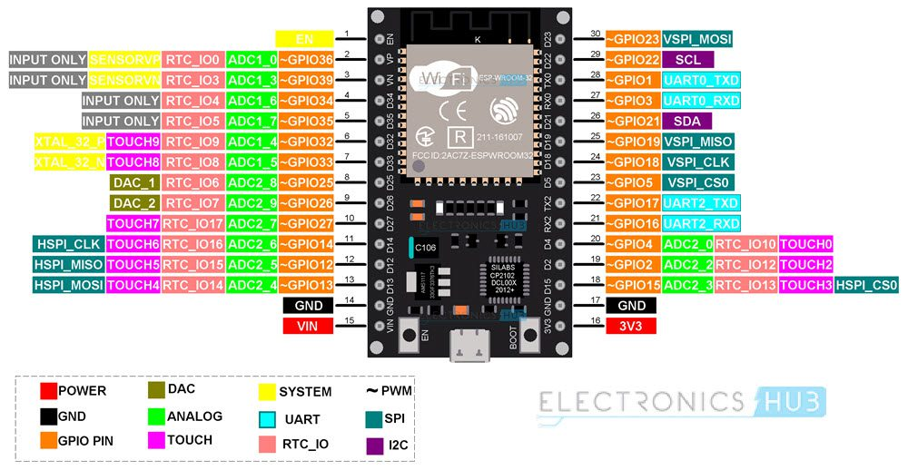

# FSR pressure sensors

## References

Written tutorials:

https://www.makerguides.com/fsr-arduino-tutorial/

[Force Sensitive Resistor Hookup Guide - SparkFun Learn](https://learn.sparkfun.com/tutorials/force-sensitive-resistor-hookup-guide/all)

[Arduino FSR Sensor (FSR-406) Proteus Library: A Comprehensive Simulation Guide - ELECTRONICS TREE](https://electronicstree.com/arduino-fsr-sensor-proteus-library/)

Amphenol clincher connectors:

[Clincher Flex Connectors | FCI Basics | Industrial Connectors | FFC/FPC](https://www.amphenol-cs.com/product-series/clincher-flex-connectors.html?page=1&orientation[filter]=Vertical%2C20064&termination_style[filter]=Crimping%2C27303&number_of_contacts[filter]=2%2C20291)

66226-002LF (2-pin Male) and 65801-002LF (2-pin Female) available in Digikey (much more expensive in Sparkfun)

| Index | Quantity | Digikey Reference | Manufacturer Reference | Description                   | Unit price EUR | Price total EUR | Comment      |
| ----- | -------- | ----------------- | ---------------------- | ----------------------------- | -------------- | --------------- | ------------ |
| 1     | 50       | 609-2176-ND       | 66226-002LF            | CONN FFC HEADER 2POS 2.54MM   | 0,532          | 26,60           | 2-pin Male   |
| 2     | 50       | 609-2158-ND       | 65801-002LF            | CONN FFC FPC RCPT 2POS 2.54MM | 0,589          | 29,45           | 2-pin Female |

Youtube videos:

[How to Use a Force Sensor with an Arduino (Lesson #23)](https://www.youtube.com/watch?app=desktop&v=r7oWtcE6QQc)

[Force Sensing Materials - YouTube](https://www.youtube.com/watch?v=2XiRnoc8ZRo)

[Force Sensor with Arduino, Force sensing Resistor FSR, Force Resistor, Force Sensitive Resistor](https://www.youtube.com/watch?v=-jLctZvKvBU)

[Force Sensitive Resistors - Pressure Sensing for your Arduino Projects](https://www.youtube.com/watch?app=desktop&v=sSdEwA7s8bE)


YL-38 LM393 sensor converter module / comparator module



See this link: [MODULO COMPARADOR LM393 YL38 5V PARA ARDUINO ESP32](https://ssdielect.com/arduino-y-compatibles-1/5868-modyl38.html)

Diagram from here: [soldering - YL 38 moisture sensor - Electrical Engineering Stack Exchange](https://electronics.stackexchange.com/questions/345152/yl-38-moisture-sensor)

## ESP32 dev board

Ref: [ESP32 Pinout | ESP32 WROOM Pinouts](https://www.electronicshub.org/esp32-pinout/)



## Simple digital poll

Pinout

| YL38 pin | ESP32 pin   | Signal         |
| -------- | ----------- | -------------- |
| A0       |             |                |
| D0       | GPIO18 (24) | digital signal |
| GND      | GND (17)    | power          |
| VCC      | 3V3 (16)    | ground         |

See [/scripts/analog.py](./scripts/digital.py)

```python
import machine
import utime

DO_PIN = 18   # change to the pin you connect DO to

do = machine.Pin(DO_PIN, machine.Pin.IN)  # no pull configured; module drives the pin

def loop(delay=0.1):
    try:
        while True:
            state = do.value()   # 1 or 0
            print(state)
            utime.sleep(delay)
    except KeyboardInterrupt:
        print("Stopped.")

if __name__ == "__main__":
    print("Polling DO pin. Press Ctrl-C to stop.")
    loop()

```

## Analog

Pinout

| YL38 pin | ESP32 pin   | Signal         |
| -------- | ----------- | -------------- |
| A0       | GPIO04 (20) | analog signal  |
| D0       | GPIO18 (24) | digital signal |
| GND      | GND (17)    | power          |
| VCC      | 3V3 (16)    | ground         |

See [/scripts/analog.py](./scripts/analog.py)

```python
import machine
import utime

AO_PIN = 4   # ADC-capable pin
adc = machine.ADC(machine.Pin(AO_PIN))
adc.atten(machine.ADC.ATTN_11DB)    # full range ~0..3.3V
adc.width(machine.ADC.WIDTH_12BIT)  # 0..4095

def read_voltage():
    raw = adc.read()
    v = (raw / 4095.0) * 3.3
    return raw, v

try:
    while True:
        raw, v = read_voltage()
        print("raw:", raw, "voltage:{:.3f}V".format(v))
        utime.sleep(0.2)
except KeyboardInterrupt:
    print("Stopped.")

```

